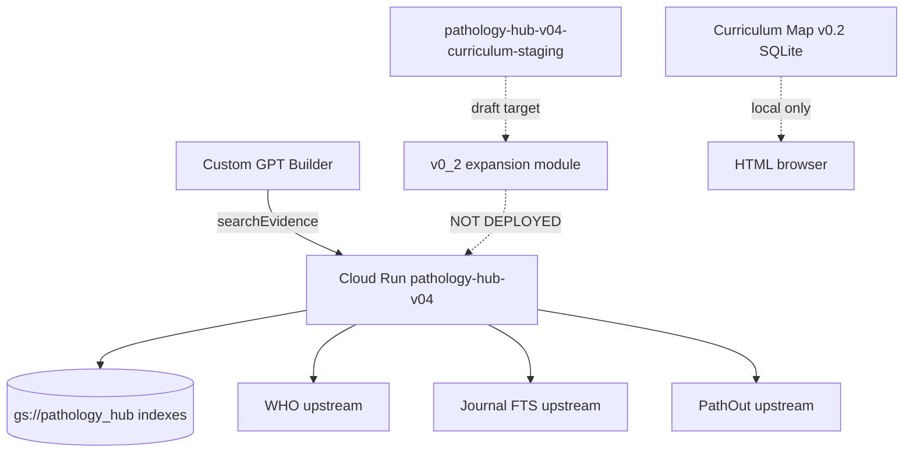

# Handoff — Pathology Hub Production Readiness

**Date:** 2026-07-05  
**Workstream:** Production Readiness / Backend API / Evidence RAG / Product Writing  
**Author:** Cursor Agent session (documentation + scripts only — no deploy, no application code changes)

---

## Purpose

Deliver a production-readiness and execution package for Pathology Hub: executive plan, backend recovery runbook, v0_2 product spec, GPT QA plan, benchmark strategy, local dev runbook, engineering tickets, read-only recovery script, staging validation wrapper, and this handoff summary.

**No production deploy, GCS mutation, GPT Builder change, or application code edit was performed in this session.**

---

## Inputs assumed

| Input | Source |
|-------|--------|
| GCP project | `pathology-annotation-project` |
| Buckets | `gs://pathology_hub`, `gs://pathology-hub-0` |
| Live API | `pathology-hub-v04` → `https://pathology-hub-v04-vorn5q2kga-uc.a.run.app` |
| Staging API (draft) | `pathology-hub-v04-curriculum-staging` |
| Action | `searchEvidence` / `POST /evidence/search` only |
| Auth | Header `X-API-Key` (Secret Manager: `pathology-hub-api-key`) |
| Handoff docs | `project_sources/updates/20260704/` (complete + v3 handoffs) |
| v0_1 live benchmark | `06_audits/evidence_retrieval_writable/benchmark_v0_1/` (979/1008 hits) |
| v0_2 local module | `backend/evidence_search_reliability_v0_2/` |
| Curriculum Map v0.2 | `release_artifacts/curriculum_map_v0_2/` (local only) |
| AGENTS.md | Workspace canonical rules |

**Note:** Mission brief referenced `README.md`, `MANIFEST.csv`, `00_start_here/*`, etc. — these paths are **not present** at repo root. Truth was synthesized from available handoffs and audits.

---

## Outputs produced

### Executive and planning

| Document | Description |
|----------|-------------|
| `docs/PRODUCTION_READINESS_MASTER_PLAN_20260705.md` | Current state, gates, risks, order of operations |
| `docs/BACKEND_SOURCE_RECOVERY_PLAN_20260705.md` | Source problem, GCS findings, recovery commands |
| `docs/EVIDENCE_SEARCH_RELIABILITY_V0_2_PRODUCT_SPEC.md` | v0_2 product spec with examples and acceptance criteria |
| `docs/GPT_BUILDER_FRONTEND_QA_PLAN_20260705.md` | GPT Preview test plan with exact prompts |
| `docs/REGRESSION_AND_BENCHMARK_STRATEGY_20260705.md` | Smoke, live, offline, guardrails, schemas |
| `docs/LOCAL_DEV_WITH_CURSOR_CODEX_RUNBOOK_20260705.md` | WSL/Cursor/gcloud local dev manual |
| `docs/NEXT_10_ENGINEERING_TICKETS_20260705.md` | PH-PR-01 through PH-PR-10 |

### Scripts

| Script | Description |
|--------|-------------|
| `commands/read_only_cloudrun_source_recovery.sh` | Read-only Cloud Run / AR / Build / GCS audit |
| `commands/run_v0_2_staging_validation.sh` | Staging-only validation; refuses production URL |

### This packet

| File | Description |
|------|-------------|
| `HANDOFF_PRODUCTION_READINESS_20260705.md` | You are here |

---

## Files created (complete list)

```
HANDOFF_PRODUCTION_READINESS_20260705.md
docs/PRODUCTION_READINESS_MASTER_PLAN_20260705.md
docs/BACKEND_SOURCE_RECOVERY_PLAN_20260705.md
docs/EVIDENCE_SEARCH_RELIABILITY_V0_2_PRODUCT_SPEC.md
docs/GPT_BUILDER_FRONTEND_QA_PLAN_20260705.md
docs/REGRESSION_AND_BENCHMARK_STRATEGY_20260705.md
docs/LOCAL_DEV_WITH_CURSOR_CODEX_RUNBOOK_20260705.md
docs/NEXT_10_ENGINEERING_TICKETS_20260705.md
commands/read_only_cloudrun_source_recovery.sh
commands/run_v0_2_staging_validation.sh
```

---

## Schemas used

| Schema | Location / purpose |
|--------|-------------------|
| `evidence_search_response.v1.5.8` | Live API response (handoff + benchmark) |
| `pathology_hub_health.v1.5.8` | Health endpoint |
| `evidence_query_expansion_rules.v0_2` | `backend/query_expansion_rules_v0_2.json` |
| `curriculum_map_v0_2` | Local curriculum build |
| `evidence_retrieval_benchmark_audit.v1` | Proposed in benchmark strategy |
| `backend_source_recovery_audit.v1` | Emitted by recovery script |
| `v0_2_staging_validation_audit.v1` | Emitted by staging validation script |
| `pathology_hub_codex_handoff.current_status.v1` | Handoff machine-readable status |

---

## GCS paths assumed

### Live backend-consumed indexes

```
gs://pathology_hub/03_indexes/textbooks/vector/textbook_lean_vector_docstore.jsonl
gs://pathology_hub/03_indexes/pathology_outlines/.../pathout_ap_diagnostic_vector_docstore.jsonl
gs://pathology_hub/03_indexes/lectures/vector_STRICT_CYTO_v9/lecture_timecoded_vector_docstore_STRICT_CYTO_v9.jsonl
gs://pathology_hub/03_indexes/journals/vector/journal_vector_docstore.jsonl
gs://pathology_hub/03_indexes/journals/vector/journal_faiss.index
```

### Audits and backups

```
gs://pathology_hub/06_audits/tags/governance/v10_5/PATHOLOGY_HUB_GOVERNED_CLEANUP_API_PROOF_v10_5_2.json
gs://pathology_hub/06_audits/backend_api/
gs://pathology_hub/99_backups/backend_api/
gs://pathology_hub/99_backups/governance_v10_5/
```

### Legacy sources

```
gs://pathology-hub-0/WHO/WHO_JSON_PROCESSED/*.json
gs://pathology-hub-0/source_pdfs/
gs://pathology-hub-0/source_videos/
```

---

## API endpoints

### Provided (live)

| Method | Path | operationId |
|--------|------|-------------|
| GET | `/health` | — |
| POST | `/evidence/search` | `searchEvidence` |

### Needed (not proven live)

- Tag browse modes (`tag_auto`, `tag_prefix`, `tag_browse`) — draft OpenAPI v1.6.1 / v1.7.0 only
- Server-side v0_2 query expansion — local module exists, **not deployed**

### External contract rule

**One GPT Action only.** Do not add operations.

---

## Integration points



| Integration | Status |
|-------------|--------|
| GPT → production API | Live |
| v0_2 → search handler | **Not integrated server-side** |
| Curriculum tag index → API | **Not live** |
| Static HTML browsers | Separate from API (do not treat as source truth) |
| v10.5 governed metadata | Promoted + API proven |

---

## Tests / audits referenced

| Audit / test | Result | Location |
|--------------|--------|----------|
| v10.5.2 API proof | PASS (200, forbidden tags 0) | GCS + handoff |
| v0_1 live benchmark | 97.1% (979/1008) | `benchmark_v0_1/` |
| v0_2 unit tests | 27/27 PASS | local |
| v0_2 smoke | 10/10 PASS | local |
| v0_2 offline replay | v0_1 hits preserved | `benchmark_v0_2/` |
| v0_2 live client-side benchmark | 979/1008 — miss target FAIL | `benchmark_v0_2/` |
| Offline regression suite | 10/10 PASS | benchmark review package |
| Curriculum Map v0.2 | Local visibility gate PASS | `release_artifacts/curriculum_map_v0_2/` |
| Backend source recovery | **Not run this session** | Run `commands/read_only_cloudrun_source_recovery.sh` |

---

## Known limitations

1. **Backend source not authoritatively recovered** — local `app.py` is 1.5.7; live is 1.5.10-html-bundle.
2. **v0_2 is client-side / simulated for benchmark** — not server-side integrated; GPT Action does not get expansion.
3. **Miss reduction target not met** — 29 misses vs ≤14 target.
4. **WHO weakest source** — 92.1% in v0_1 benchmark.
5. **Journal Virchows content proof open** — health shows union; broad queries returned AJSP FTS-only.
6. **Histopathology** — normalized, not live vectorized.
7. **Tag-aware browse API** — draft only.
8. **Figure cleanup** — v10.5 excluded 1/49,526; deeper junk may remain.
9. **Numbered handoff folder structure** from mission brief absent — used 20260704 handoffs instead.
10. **gcloud read-only audit not executed** in this session (shell unavailable) — script provided for local run.

---

## Next steps (recommended order)

1. **Run** `bash commands/read_only_cloudrun_source_recovery.sh` (requires gcloud auth).
2. **Execute PH-PR-02** — reconcile `app.py` to live 1.5.10 from recovered image.
3. **Execute PH-PR-03** — integrate v0_2 patch; pass unit tests.
4. **Deploy to staging only** (PH-PR-04) with explicit approval.
5. **Run** `bash commands/run_v0_2_staging_validation.sh` with `RUN_LIVE_BENCHMARK=1`.
6. **Tune rules** if misses >14 (PH-PR-06).
7. **Execute GPT QA plan** against production (read-only) — PH-PR-08.
8. **Request production approval** only when all gates green — phrase: `APPROVE_PRODUCTION_DEPLOY_EVIDENCE_SEARCH_V0_2`.

---

## Session report (required fields)

### 1. Files created

Ten files listed in [Files created](#files-created-complete-list) above.

### 2. Most important blocker

**Authoritative backend source recovery and server-side v0_2 integration.** Without matching live `app.py` (1.5.10) to a deployable tree, staging deploy and GPT Action reliability upgrades are blocked.

### 3. Backend source recovered?

**No (partial only).** `backend/pathology_hub_v04_curriculum/app.py` exists at version **1.5.7-page-images-v04**, which does not match live **1.5.10-html-bundle**. GCS inventory shows `06_audits/backend_api/` and `99_backups/backend_api/` but no plain source at bucket root. Recovery script provided; not executed this session.

### 4. v0_2 server-side integrated or simulated?

**Still simulated / client-side.** The v0_2 module (`backend/evidence_search_reliability_v0_2/`) runs in local tests and client-side benchmark replay against the **production** API URL. It is **not** deployed to Cloud Run staging or production. Executive summary: *"Live staging benchmark blocked — no evidence-search staging service with v0_2 deployed."*

### 5. Single next recommended engineering action

**Run `bash commands/read_only_cloudrun_source_recovery.sh`**, then diff extracted/recovered source against `backend/pathology_hub_v04_curriculum/app.py` until version matches live health (`1.5.10-html-bundle`). This unblocks PH-PR-02 and all downstream v0_2 staging work.

---

## Safety confirmation

- [x] No production deploy
- [x] No GCS upload or mutation
- [x] No API keys printed or saved
- [x] No GPT Builder schema change
- [x] No application code modified (docs and command scripts only)
- [x] One Action constraint preserved

---

## Related reading

Start here for local work: `docs/LOCAL_DEV_WITH_CURSOR_CODEX_RUNBOOK_20260705.md`  
Start here for leadership: `docs/PRODUCTION_READINESS_MASTER_PLAN_20260705.md`  
Start here for engineering: `docs/NEXT_10_ENGINEERING_TICKETS_20260705.md` (ticket **PH-PR-01**)
