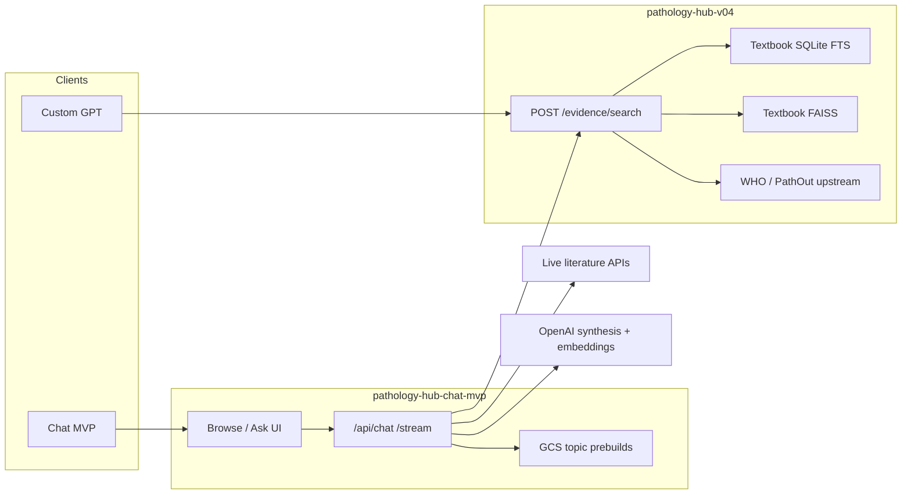

# Pathology Hub

Evidence-grounded pathology knowledge system: retrieve from WHO, PathologyOutlines, textbooks, lectures/videos, and live literature; synthesize ExpertPath-style topic pages and Ask answers; expose the same evidence API to Chat MVP and Custom GPT.

This repository is the **dev / ops / product spine** for Pathology Hub — backend evidence API, Chat MVP frontend, corpus pipelines, audits, and handoffs. Treat `AGENTS.md` and CURRENT_MASTER_SPINE packages under `project_sources/` as authoritative for canonical state.

---

## Live surfaces

| Surface | URL / resource | Role |
|--------|----------------|------|
| Chat MVP | https://chat.pathologynotebook.com | Browse taxonomy + Ask + topic pages |
| Evidence API | `pathology-hub-v04` on Cloud Run | `POST /evidence/search` (canonical operation) |
| Custom GPT | GPT Builder package under `gpt_builder/` | Same evidence Action (`X-API-Key`) |
| Prebuilt topic pages | `gs://pathology_hub/api_exposed/chat_mvp_topic_prebuilds_v0_1/pages/` | Cached Browse leaf pages (~3.6k JSON sidecars) |

GCP project: **`pathology-annotation-project`**

Canonical buckets:

- `gs://pathology_hub` — staged, normalized, indexes, API-exposed artifacts
- `gs://pathology-hub-0` — legacy / source library (e.g. textbook page images)

---

## What the product does

1. **Retrieve** multi-source evidence (WHO, PathOut, textbooks via hybrid FTS+FAISS, lectures/videos, live literature APIs).
2. **Filter** by Browse root when building topic pages (root-narrow), apply figure quality filters, diversify by source.
3. **Synthesize** grounded answers with OpenAI (`gpt-5.6-luna` / terra / sol allowlist) — never invent URLs or claims outside the evidence bundle.
4. **Serve** either live Ask answers or **prebuilt topic-page caches** for Browse leaves (instant load from GCS).

Browse navigation is a combined WHO + ABPath taxonomy (`browse_tag_index_v0_1.json`). Forensic Pathology was removed from Browse when corpus coverage was too thin.

---

## Architecture (high level)



**Keep workstreams separate** (do not conflate):

- Evidence RAG (hub search)
- Report-style RAG
- Gross template generation
- HTML rendering / teaching bundles
- Backend API (`pathology-hub-v04`)
- Chat MVP frontend
- Custom GPT frontend

---

## Repository layout

```text
AGENTS.md                 # Non-negotiable local-dev / data rules
README.md                 # This file
frontend/
  pathology_hub_chat_mvp/ # Chat UI + /api/chat + Browse + prebuild scripts
backend/
  pathology_hub_v04_live_recovered/  # Evidence API source (Cloud Run)
  pathology_hub_v04_curriculum/      # Curriculum-map related backend pieces
  evidence_search_reliability_v0_2/  # Reliability / expansion artifacts
scripts/                  # Corpus, curriculum, lecture, figure pipelines
docs/                     # Plans, handoffs, API contracts, runbooks
audits/                   # Dated audit JSON / deploy logs (tracked summaries)
outputs/                  # Local build outputs (gitignored)
gpt_builder/              # Custom GPT rebuild packages
project_sources/          # Canonical “master spine” update packages
release_artifacts/        # Production release dossiers
tests/                    # Unit / contract tests (esp. Chat MVP)
notebooks/                # Colab / notebook handoffs
tools/                    # Smaller utilities (e.g. curriculum browser)
```

Detailed Chat MVP ops: [`frontend/pathology_hub_chat_mvp/README.md`](frontend/pathology_hub_chat_mvp/README.md)

---

## GCS data layers

Do **not** overwrite original normalized records. Prefer sidecars, enriched outputs, manifests, and audits.

| Layer | Typical prefix | Purpose |
|-------|----------------|---------|
| Source | `01_source/` / `01_sources/` | Ingested originals |
| Staged | `01_staged/` | Extracted / prepared assets (e.g. textbook figures) |
| Normalized | `02_normalized/` | Stable records + registries |
| Indexes | `03_indexes/` | Lean textbook SQLite/FAISS, figures JSONL, etc. |
| API artifacts | `04_api_artifacts/`, `api_exposed/` | What clients may load (prebuilds, exposed indexes) |
| HTML | `05_html/` | Rendered teaching HTML |
| Audits | `06_audits/`, repo `audits/` | Counts, paths, limitations |
| Handoffs / backups | `07_handoffs/`, `99_backups/` | Ops packages |

**Before any GCS upload**, produce an audit JSON with `schema_version`, input/output paths, counts, and known limitations.

**Do not claim** a source is indexed, vectorized, tagged, or API-exposed unless an audit, manifest, `/health`, or project source proves it.

---

## Cloud Run services (cost-aware)

As of the Aug 2026 cost cut, production services in `pathology-annotation-project` are:

| Service | Role |
|---------|------|
| `pathology-hub-v04` | Evidence API (textbooks + WHO/PathOut proxy, figures) |
| `pathology-hub-chat-mvp` | Chat MVP (HTTPS → chat.pathologynotebook.com) |
| `pathology-hub` | Legacy / related hub service |
| `pathology-hub-pathout-api` | PathOut-related API |
| `pathology-hub-journal-api` | Journals path (local journal RAG retired; see docs) |

Staging/smoke/hello leftovers were deleted to stop idle spend. Services are typically **`minScale=0`** (scale to zero when idle → cold start on first request).

Bring always-warm back (costs money):

```bash
gcloud run services update pathology-hub-v04 --region=us-central1 --min-instances=1
gcloud run services update pathology-hub-chat-mvp --region=us-central1 --min-instances=1
```

**Important:** Scaling or deleting Cloud Run services does **not** delete GCS prebuilds or corpus data.

---

## Chat MVP (product entry point)

### Modes

| Mode | When |
|------|------|
| `topic_page` | Browse leaf / “what is X” entity asks → ExpertPath-style page |
| `gpt_like` | Focused Ask (including **aspect** asks: `ihc for…`, `stains for…`) |
| `compare_sources` | vs / compare |
| `search_only` | Raw cards, no synthesis |
| `visual` / `html_teaching` | Figure- or HTML-forward |

Aspect asks must **not** be forced into full topic-page iterative retrieval (see Ask routing in `app.py` / `static/app.js`).

### Topic prebuilds

- Built via `frontend/pathology_hub_chat_mvp/scripts/prebuild_topic_pages_pilot_v0_1.py` against live `/api/chat`
- Uploaded to `gs://pathology_hub/api_exposed/chat_mvp_topic_prebuilds_v0_1/pages/`
- Browse tries GCS cache first, then live build
- Prefer `--parallel 2` on large batches (higher concurrency can drop textbook retrieval under load)

### Local run

```bash
cd frontend/pathology_hub_chat_mvp
./scripts/run_local.sh
# → http://127.0.0.1:8000/
```

Secrets (env or Secret Manager): `PATHOLOGY_HUB_API_KEY` / `HUB_API`, `OPENAI_API_KEY` (`OPENAI`).

Deploy Chat MVP:

```bash
cd frontend/pathology_hub_chat_mvp
./scripts/deploy_cloud_run_https_v0_1.sh
```

---

## Evidence API (`pathology-hub-v04`)

- **Canonical op:** `POST /evidence/search` (`searchEvidence`)
- Auth: `X-API-Key`
- Textbooks: hybrid SQLite FTS + FAISS + RRF; falls back to FTS-only if embeddings/OpenAI quota fail
- OpenAPI / contracts: see `docs/API_CONTRACT_*` and root `openapi_pathology_hub_unified_searchEvidence_*.yaml`
- Recovered deployable source: `backend/pathology_hub_v04_live_recovered/`

Health check: `GET {API}/health` — use this (not guesses) for “is textbooks loaded / vectorized / api_exposed?”

---

## Corpus & pipeline workstreams

Major script families under `scripts/` and Chat MVP `scripts/`:

- **Browse taxonomy** — WHO + ABPath index builders
- **Topic prebuild / upload / coverage audits**
- **Textbook lean indexes, figures, page images, quality flags**
- **Lecture / YouTube deck packages → vector indexes**
- **Curriculum map** (v0.2+) and gap-fill tooling
- **Anki / Heme builder handoffs** (docs + packages)

Outputs land in `outputs/` (gitignored). Durable proofs go to `audits/` or GCS audit prefixes.

---

## Tests

```bash
# Chat MVP unit / contract suite (from repo root)
PYTHONPATH=frontend/pathology_hub_chat_mvp \
  frontend/pathology_hub_chat_mvp/.venv/bin/python -m unittest tests.test_pathology_hub_chat_mvp -v

# Chat MVP smoke (offline TestClient; optional --live)
cd frontend/pathology_hub_chat_mvp
./.venv/bin/python scripts/smoke_test_chat_mvp_v0_1.py
```

---

## Documentation map

| Doc | Use when |
|-----|----------|
| `AGENTS.md` | Always — data/API honesty rules |
| `docs/ACTIVE_CONTEXT.md` | Recent product decisions (may lag; verify live) |
| `frontend/pathology_hub_chat_mvp/README.md` | Chat MVP day-to-day |
| `docs/PLAN_CHAT_MVP_*` / `docs/HANDOFF_*` | Feature plans and agent handoffs |
| `docs/API_CONTRACT_*` | Evidence API schema versions |
| `docs/JOURNALS_RETIRED_ARCHIVE.md` | Local journal RAG retirement |
| `project_sources/updates/*/docs/CURRENT_MASTER_SPINE_*` | Canonical “what is live” packages |
| `release_artifacts/` | Production release / rollback dossiers |

---

## Safety & honesty rules (summary)

1. Ground synthesis in retrieved evidence only; no fabricated DOIs/URLs.
2. Never commit secrets or paste API keys into audits/docs.
3. Sidecars over destructive rewrites of normalized records.
4. Prove indexing / vectorization / API exposure with manifests or `/health`.
5. Keep workstreams and GCS layers separate.
6. Prefer audits with schema version + counts + known limitations on every batch upload.

---

## Status snapshot (ops)

Approximate live Chat MVP prebuild cache: **~3600+** topic pages in GCS. Browse leaf count is higher (~5k); remaining leaves fall back to live `/api/chat` until prebuilt.

Known product caveats (verify before claiming fixed):

- Some roots historically prebuilt with **Textbooks: 0** (`not_requested` under load, or root-narrow / thin corpus) — especially parts of breast (Aug 6 batch), peds, heme, skin, eye.
- OpenAI quota exhaustion breaks embeddings **and** synthesis; textbook FTS fallback keeps search alive when hybrid vector fails.
- Cold starts after `minScale=0` are expected.

---

## Contributing / agents

- Feature branches: `cursor/<short-name>-NNNN` (team convention).
- Prefer small, auditable PRs; do not mix unrelated workstreams.
- Cloud agents: see `.cursor/environment.json` and `docs/HANDOFF_CLOUD_AGENT_ONLINE_NEXT_STEPS.md`.

For day-to-day Chat MVP questions, start with the frontend README. For “what is canonical in prod?”, start with the latest CURRENT_MASTER_SPINE under `project_sources/updates/` plus a live `/health` check.
