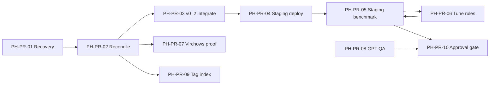

# Next 10 Engineering Tickets — Pathology Hub Production Readiness

**Date:** 2026-07-05  
**Format:** Each ticket is independently actionable with clear stop conditions.

---

## PH-PR-01 — Backend source recovery (read-only audit)

| Field | Value |
|-------|-------|
| **Workstream** | Backend API |
| **Purpose** | Establish authoritative match between live Cloud Run revision and recoverable source tree |
| **Inputs** | GCP project access; `commands/read_only_cloudrun_source_recovery.sh` |
| **Files touched** | `audits/backend_source_recovery/<timestamp>/*` (new audit outputs only) |
| **Commands/tests** | `bash commands/read_only_cloudrun_source_recovery.sh`; optional docker pull/export |
| **Acceptance criteria** | Audit JSON with image digest, active revision, file list; diff vs `backend/pathology_hub_v04_curriculum/app.py`; version matches live health (1.5.10-html-bundle) |
| **Risk** | Image may be inaccessible; extracted source may differ from repo copy |
| **Stop condition** | Stop after audit JSON complete — do not deploy. Escalate if no image pull access. |

---

## PH-PR-02 — Reconcile local app.py to live 1.5.10

| Field | Value |
|-------|-------|
| **Workstream** | Backend API |
| **Purpose** | Replace stale 1.5.7 local app with recovered 1.5.10 source |
| **Inputs** | PH-PR-01 audit outputs |
| **Files touched** | `backend/pathology_hub_v04_curriculum/app.py`, `Dockerfile`, `requirements.txt` |
| **Commands/tests** | Local `uvicorn app:app --port 8080`; smoke against localhost with test key |
| **Acceptance criteria** | Local health version string matches production; smoke 3/3 payloads pass |
| **Risk** | Large diff may break local-only paths; GCS env vars required at startup |
| **Stop condition** | Stop if recovered source cannot start — reopen PH-PR-01 Path E (reconstruct) |

---

## PH-PR-03 — Integrate v0_2 patch into search handler

| Field | Value |
|-------|-------|
| **Workstream** | Evidence RAG / Backend API |
| **Purpose** | Wire `preprocess_evidence_search_request` and `patch_search_response` before/after dispatch |
| **Inputs** | PH-PR-02 reconciled app; `backend/evidence_search_reliability_v0_2/` |
| **Files touched** | `app.py`, `Dockerfile` (COPY module + rules JSON), `evidence_search_v0_2_patch.py` |
| **Commands/tests** | `python3 -m unittest discover -s tests -p 'test_evidence_*_v0_2.py' -v` |
| **Acceptance criteria** | All v0_2 unit tests pass; `/evidence/search` returns same schema; expansion enabled via env |
| **Risk** | Hook point wrong → silent no-op or double expansion |
| **Stop condition** | Stop before container build if unit tests fail |

---

## PH-PR-04 — Staging deploy v0_2 (curriculum-staging or evidence-staging)

| Field | Value |
|-------|-------|
| **Workstream** | Backend API |
| **Purpose** | First server-side v0_2 on non-production Cloud Run service |
| **Inputs** | PH-PR-03 integrated image; staging service name decision (master plan D1) |
| **Files touched** | Cloud Run staging service only; `06_audits/deploy_staging_v0_2.json` audit |
| **Commands/tests** | `gcloud builds submit`; `gcloud run deploy` **staging only**; `bash commands/run_v0_2_staging_validation.sh` |
| **Acceptance criteria** | Staging health 200; smoke 10/10; env `EVIDENCE_QUERY_EXPANSION_ENABLED=true` |
| **Risk** | Accidental production deploy — verify service name twice |
| **Stop condition** | **Requires explicit user approval to deploy** — read-only planning stops here by default |

---

## PH-PR-05 — Live v0_2 staging benchmark

| Field | Value |
|-------|-------|
| **Workstream** | Evidence RAG / QA |
| **Purpose** | Measure server-side miss reduction vs v0_1 baseline |
| **Inputs** | PH-PR-04 staging URL; `benchmark_entities_v0_1.csv` |
| **Files touched** | `06_audits/evidence_retrieval_writable/benchmark_v0_2_staging/*` |
| **Commands/tests** | `python .../run_live_v0_2_benchmark.py --base-url $STAGING_URL` |
| **Acceptance criteria** | Hits ≥979/1008 AND misses ≤14; 0 figure leaks; delta CSV shows net improvement |
| **Risk** | Staging may lack production GCS artifact access — health/manifest must match |
| **Stop condition** | If misses >14, proceed to PH-PR-06 (tuning) — do not promote |

---

## PH-PR-06 — Tune expansion rules from staging misses

| Field | Value |
|-------|-------|
| **Workstream** | Evidence RAG |
| **Purpose** | Close abbreviation miss gap (SSL, CRC, CIS, bullous pemphigoid, CMF) |
| **Inputs** | PH-PR-05 failure analysis; `V0_1_TO_V0_2_DELTA.csv` |
| **Files touched** | `backend/query_expansion_rules_v0_2.json`; unit tests |
| **Commands/tests** | Unit tests; offline replay; re-run PH-PR-05 subset |
| **Acceptance criteria** | Abbreviation miss count ≤50% of v0_1; zero new wrong-root regressions |
| **Risk** | Over-tuning causes regressions on exact_name queries |
| **Stop condition** | Max 2 tuning iterations before architecture review |

---

## PH-PR-07 — Journal Virchows targeted API proof

| Field | Value |
|-------|-------|
| **Workstream** | Evidence RAG / Journals |
| **Purpose** | Prove journal vector returns Virchows Archiv rows (not AJSP FTS-only) |
| **Inputs** | Live API key; docstore sample DOIs/titles from v4.4 audit |
| **Files touched** | `audits/journal_virchows_api_proof_<timestamp>.json` |
| **Commands/tests** | Custom probes: exact title, exact DOI, unique excerpt; inspect `journal`, `retrieval_mode` |
| **Acceptance criteria** | ≥1 query returns `journal` containing "Virchows Archiv" with vector or hybrid mode |
| **Risk** | Requires backend source (PH-PR-02) to debug RRF if probes fail |
| **Stop condition** | Document as known limitation if vector path confirmed loaded but ranking fails |

---

## PH-PR-08 — GPT Builder QA execution (read-only production)

| Field | Value |
|-------|-------|
| **Workstream** | Custom GPT Frontend |
| **Purpose** | Execute `docs/GPT_BUILDER_FRONTEND_QA_PLAN_20260705.md` prompts; record PASS/FAIL |
| **Inputs** | Production GPT Preview; working Action auth |
| **Files touched** | `audits/gpt_builder_qa_20260705/results.csv` (local only) |
| **Commands/tests** | Manual GPT Preview prompts A1–F2 |
| **Acceptance criteria** | Zero hallucination FAILs on E1–E3; staged retrieval PASS on A1 |
| **Risk** | GPT instruction drift may cause false FAIL — fix instructions not API |
| **Stop condition** | Complete all tests; do not change OpenAPI until PH-PR-05 passes |

---

## PH-PR-09 — Tag runtime SQLite index (staging prep)

| Field | Value |
|-------|-------|
| **Workstream** | Evidence RAG / Curriculum |
| **Purpose** | Build approved-only tag index from governed metadata for future tag browse modes |
| **Inputs** | GCS docstore paths; `release_artifacts/curriculum_map_v0_2/curriculum_tag_index_v0_2.sqlite` as reference |
| **Files touched** | `backend/tag_runtime/` (new); `codex_local/build_minimal_tag_index.py` (extend) |
| **Commands/tests** | Index build script; local query tests for `tag_prefix` |
| **Acceptance criteria** | SQLite loads ABPath + governed tags; 0 forbidden patterns in index; no live deploy |
| **Risk** | Scope creep into v11 promotion — index local/staging only |
| **Stop condition** | Stop before adding new OpenAPI operations — tag modes remain draft |

---

## PH-PR-10 — Production promotion gate review (approval only)

| Field | Value |
|-------|-------|
| **Workstream** | Production Readiness |
| **Purpose** | Consolidate gates and request explicit production deploy approval |
| **Inputs** | PH-PR-05 benchmark; PH-PR-08 QA; smoke/regression JSON |
| **Files touched** | `06_audits/evidence_search_reliability_v0_2_production_readiness/FINAL_APPROVAL_REQUIRED.md` (update) |
| **Commands/tests** | Checklist from `docs/PRODUCTION_READINESS_MASTER_PLAN_20260705.md` |
| **Acceptance criteria** | All 10 production entry criteria green; user provides `APPROVE_PRODUCTION_DEPLOY_EVIDENCE_SEARCH_V0_2` |
| **Risk** | Premature approval with client-side-only v0_2 proof |
| **Stop condition** | **No deploy without approval phrase** — ticket closes with signed checklist or blocked status |

---

## Suggested execution order

```
PH-PR-01 → PH-PR-02 → PH-PR-03 → PH-PR-04 → PH-PR-05 → PH-PR-06
                                    ↘ (parallel) PH-PR-08
PH-PR-05 pass → PH-PR-10
PH-PR-07 independent after PH-PR-02
PH-PR-09 parallel after PH-PR-02, before tag-aware schema
```

## Ticket dependency graph


