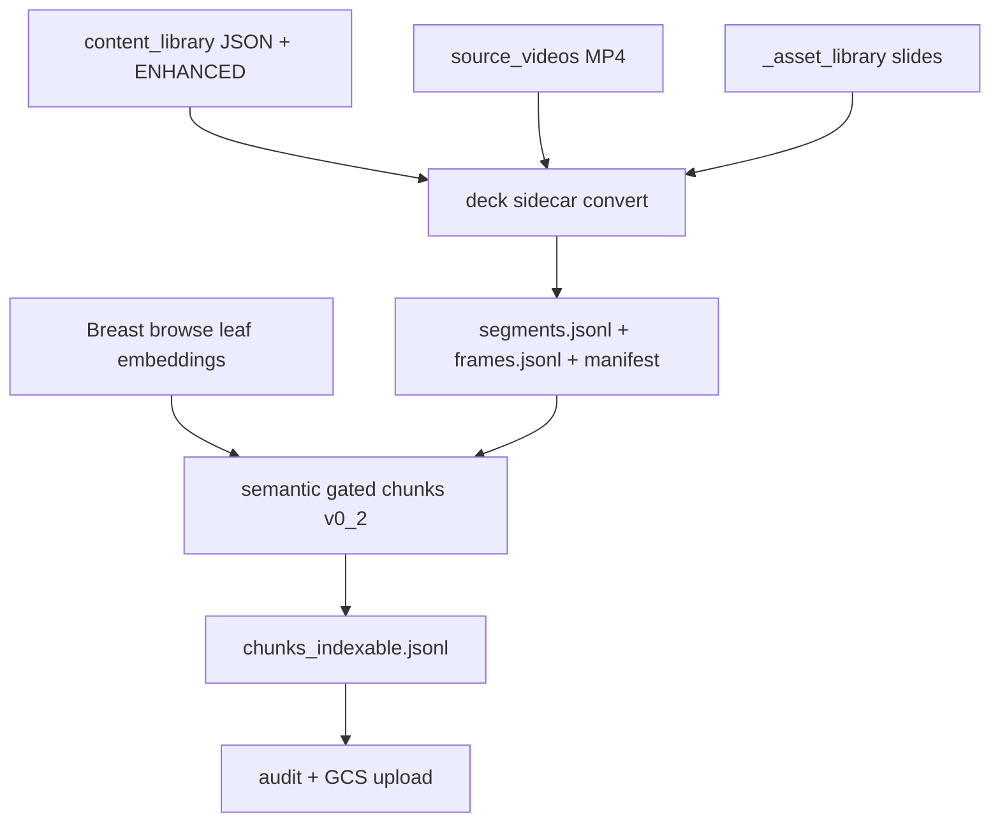

# Plan — Breast_Lecture legacy content_library → deck packages

Date: 2026-07-12  
Status: **Phase 1 + Breast leaf embeddings + semantic gated chunks done** (vector rebuild still gated)

### Inventory why Breast

No further `*_chatgpt_readable_package.zip` under `gs://pathology_hub/`.  
Next complete triad (MP4 + `_asset_library` + `_content_library`) = **Breast_Lecture** (12/12/12).

### Results (2026-07-12)

- **12/12** packages converted from legacy content_library → deck sidecars  
- **12/12** MP4 joins (`filename_match_source_videos`), including Epithelial → `…Part 1_Chen.mp4`  
- Leaf embeddings: **173 `Breast::*`** → `gs://pathology_hub/06_audits/lectures/deck_packages/breast_browse_leaf_embeddings_v0_1/`  
- Gated indexable chunks: **118** across **11/12** packages (Normal intentionally empty — anatomy survey fails usefulness gates)  
- Convert audit: `gs://pathology_hub/06_audits/lectures/deck_packages/content_library_batch_20260712T042931Z/audit.json`  
- Gate audit: `gs://pathology_hub/06_audits/lectures/deck_packages/semantic_gated_v0_2_20260712T043059Z/audit.json`

| Package | Chunks (approx) | Notes |
|---------|-----------------|-------|
| Epithelial | 25 | DCIS / ADH / UDH heavy |
| Fibroepithelial | 18 | Phyllodes / fibroadenoma |
| Lobular | 20 | LCIS family |
| SpindleCell | 15 | Metaplastic / phyllodes |
| Papillary | 12 | Encapsulated / invasive papillary |
| Rad-Path | 10 | Mixed |
| IHC | 6 | Soft tags (IHC talks are hard) |
| Invasive | 5 | Near-neighbor carcinoma ambiguity still filters many |
| Prognostics | 3 | Biomarker talk → entity leaves weak |
| Grossing | 2 | Procedural — few entity matches |
| Treated | 2 | Sparse |
| Normal | 0 | By design |

### Agenda-gate tweak

Multi-entity **teaching DDx** windows (common in Breast invasive) are no longer rejected solely for naming ≥5 entities. TOC/list cues still reject true agenda dumps.

## Principles (same as Heme)

| Family | MP4 | Assets | Content JSON | Notes |
|--------|-----|--------|--------------|-------|
| **Breast_Lecture** | 12 | 12 | 12 | Cleanest complete triad |
| BST_Lecture | 6 | 6 | 6 | Small; good second |
| Gyn_Lecture | 12 | 12 | 12 | Ready after Breast |
| GI_Lecture | 13 | 13 | 13 | Ready after Breast |
| GU_Lecture | 17 | 17 | 13 | Content gaps |
| Derm_Lecture | 38 | 31 | 28 | Gaps + naming noise |
| HN / Thoracic / Other_* | — | — | — | Incomplete or weak content JSON |

No new ChatGPT-readable zips remain. Next grain is **legacy** `_content_library/lectures/<stem>.json` (+ ENHANCED when present) joined to existing MP4s/assets.

## Principles (same as Heme)

1. Sidecar only under `02_normalized/lectures/deck_packages/<package_id>/` — do **not** overwrite legacy normalized lecture JSONL.
2. Index grain **only** `chunks_indexable.jsonl` (semantic gates). Never vectorize `segments*.jsonl`.
3. Canonical video: `gs://pathology-hub-0/source_videos/<ExactMp4Name>` with `filename_match_source_videos` when present.
4. Slides: prefer ENHANCED `image_path` that resolves under `_asset_library/lectures/`; audit missing objects.
5. Tag against canonical browse leaves for that root only (**173 `Breast::*`**), not Heme.
6. Audit JSON before GCS upload (schema_version, inputs, outputs, counts, limitations).
7. Do not claim FAISS/API/Videos-strip exposure until rebuild + audit.

## Join quirk

`Breast_Lecture_Epithelial Part 1_Chen.mp4` → content/assets stem `Breast_Lecture_Epithelial`.

## Pipeline

## Scripts

- `scripts/build_lecture_deck_package_from_content_library_v0_1.py`
- `scripts/batch_process_content_library_deck_packages_v0_1.py`
- `scripts/build_browse_leaf_embeddings_v0_1.py --root Breast`
- Reuse / generalize `build_lecture_deck_semantic_indexable_chunks_v0_2.py` with `--root Breast`

## Explicitly NOT done in this phase

- FAISS / Cloud Run rebuild
- Derm/GI/GU/etc. (inventory only until Breast pilot validates)
- Overwriting `Other_*` legacy corpora
