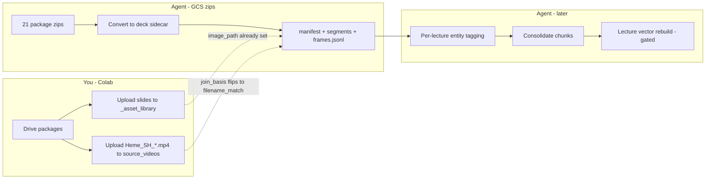

# Plan — batch Heme SH chatgpt_readable deck packages

Date: 2026-07-12  
Status: **proposed** — execute after you say go.

## Inventory (now)

**21 unique packages** on `gs://pathology_hub/` root (Aggressive B-Cell has duplicate `(6)`/`(7)`/original zips; batch keeps the best stem).

| Package stem | Zip present | Deck sidecar | Tagged + chunks | Canonical MP4 in `source_videos` |
|--------------|-------------|--------------|-----------------|----------------------------------|
| Aggressive_B_Cell | ✅ | ✅ v0_1 | ✅ | ❌ pending |
| AML | ✅ | ❌ | ❌ | ❌ |
| BM_Failure_Syndromes | ✅ | ❌ | ❌ | ❌ |
| BM_Intro | ✅ | ❌ | ❌ | ❌ |
| BM_Systemic_Manifestations | ✅ | ❌ | ❌ | ❌ |
| Histiocytic | ✅ | ❌ | ❌ | ❌ |
| Hodgkin_NLP | ✅ | ❌ | ❌ | ❌ |
| Hodgkin_Overview | ✅ | ❌ | ❌ | ❌ |
| Hodgkin_T_NK_Cell_1 | ✅ | ❌ | ❌ | ❌ |
| Hodgkin_T_NK_Cell_2 | ✅ | ❌ | ❌ | ❌ |
| IA_LPD | ✅ | ❌ | ❌ | ❌ |
| IHC_for_LPD | ✅ | ❌ | ❌ | ❌ |
| MDS_MPN_1 / 2 / 3 | ✅ | ❌ | ❌ | ❌ |
| PT_LPD | ✅ | ❌ | ❌ | ❌ |
| Plasma_Cell | ✅ | ❌ | ❌ | ❌ |
| Reactive_Lymphoid_Hyperplasia | ✅ | ❌ | ❌ | ❌ |
| Small_B_Cell_1_of_2 / 2_of_2 | ✅ | ❌ | ❌ | ❌ |
| Spleen | ✅ | ❌ | ❌ | ❌ |

Frames Colab (your side): `notebooks/Heme_SH_Lecture_Frame_Upload_to_Asset_Library_v0_1.ipynb` → `_asset_library/lectures/<stem>/`.

---

## Principles (unchanged)

1. Sidecar only under `02_normalized/lectures/deck_packages/<package_id>/` — do not overwrite legacy normalized lecture JSONL.
2. Canonical video URI: `gs://pathology-hub-0/source_videos/Heme_SH_<Topic>.mp4` with `canonical_name_pending_upload` until object exists.
3. **Never** vectorize `segments*.jsonl` — only `chunks_indexable.jsonl` after tagging.
4. Do not claim API / Videos strip until a rebuild + probe audit.

---

## Workstreams (parallel where possible)



---

## Phase 1 — Convert all zips (agent, start now)

**Goal:** Every zip → untagged deck sidecar with honest video join + frame `image_path` pointers.

**How:**

```bash
python3 scripts/batch_process_chatgpt_readable_deck_packages_v0_1.py \
  --process --upload
```

(Aggressive B-Cell already done; re-convert only if we want asset-path fields refreshed on its `frames.jsonl`.)

**Outputs per package:**

- `manifest.json`, `segments.jsonl`, `frames.jsonl`, `audit.json`
- GCS: `gs://pathology_hub/02_normalized/lectures/deck_packages/<slug>_v0_1/`
- Batch audit under `06_audits/lectures/deck_packages/batch_*`

**Not in Phase 1:** tagging, consolidation, FAISS, API.

**Risk:** Zip layout drift (missing `lecture_index.json`). Mitigate with per-zip failure row in batch audit; continue others.

---

## Phase 2 — Frames + MP4s (you / Colab, parallel with Phase 1)

Run the ipynb:

1. `DRY_RUN = True` once → spot-check paths  
2. Upload slides → `_asset_library/lectures/Heme_SH_*/`  
3. Upload MP4s → `source_videos/Heme_SH_*.mp4`

**After MP4s land:** optional agent pass to flip `raw_source_join_basis` from `canonical_name_pending_upload` → `filename_match_source_videos` on manifests (small repair script).

---

## Phase 3 — Tagging (hard part — decide before bulk)

Aggressive B-Cell has a **lecture-specific** regex entity pack. The other 20 do **not**.

### Option A — Convert-only now; tag later (recommended first cut)

Ship Phase 1 for all 21. Tagging backlog as separate PRs / rule packs per lecture (or shared Heme ontology pack).

### Option B — Generic Heme tagger v0

Shared browse-index keywords (Hodgkin, MDS, AML, spleen compartments, small B entities, …) + same `do_not_index` intro/thanks gates + sticky context. Faster coverage, noisier tags. Still consolidate with same chunker.

### Option C — Hybrid

Phase 1 all → Option B pass for coarse tags → human/LLM review packs for high-value lectures (Small B, Hodgkin, MDS/MPN, Spleen).

**Recommendation:** **A then C** — don’t block the batch convert on perfect entity maps.

Consolidation (`chunks_indexable.jsonl`) runs **only after** a package has indexable tagged segments.

---

## Phase 4 — Lecture vector rebuild (gated, later)

Only when:

- Enough packages have `chunks_indexable.jsonl`
- Non-null `video_time_url` on chunks
- Prefer: matching MP4 objects exist (or accept pending-upload URLs)

Then: rebuild lecture index from deck sidecars → smoke API → Chat MVP Videos strip.

---

## Suggested execution order (when you say go)

| Step | Who | What |
|------|-----|------|
| 1 | Agent | Phase 1 batch convert + upload + audit for all 21 |
| 2 | You | Colab frames + MP4s (can overlap with 1) |
| 3 | Together | Pick tagging option A/B/C |
| 4 | Agent | Tag + consolidate for chosen set |
| 5 | Later | Vector rebuild (explicit gate) |

---

## Explicit non-goals for the first batch convert

- No FAISS / STRICT_CYTO rebuild  
- No Cloud Run redeploy  
- No claim Videos strip plays these lectures  
- No overwrite of `Other_Heme_*` legacy content/asset libraries (new canonical stems only)  
- No inventing entity tags for lectures without a rule pack (unless you choose Option B)

---

## Open choice for you

Reply with:

1. **Go Phase 1** (convert all zips now), and  
2. Tagging preference: **A** (later) / **B** (generic) / **C** (hybrid)

I’ll execute accordingly.
