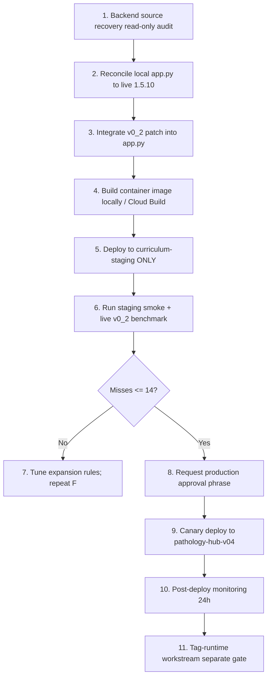

# Pathology Hub — Production Readiness Master Plan

**Date:** 2026-07-05  
**Workstream:** Production Readiness / Backend API / Evidence RAG / Product Writing  
**Canonical project:** `pathology-annotation-project`  
**Status:** Planning and staging validation only — **no production deploy authorized**

---

## Executive summary

Pathology Hub has a **live, authenticated Evidence RAG API** (`searchEvidence` / `POST /evidence/search`) on Cloud Run service `pathology-hub-v04` at version **1.5.10-html-bundle**, with governed tag metadata (v10.5) proven for standard searches. A v0_1 live benchmark achieved **97.1%** expected-hit rate (979/1,008 rows) across 35 AP entities.

Evidence Search Reliability **v0_2** (query expansion, root gating, WHO rerank) is implemented **locally** with passing unit/smoke tests, but is **not server-side integrated** on staging or production. The miss-reduction target (≤14 misses) was **not met** in client-side replay (29 misses remain).

The **primary blocker** to production readiness for v0_2 and tag-aware curriculum features is **authoritative backend source recovery and verified staging deploy** — local `app.py` exists but lags production (1.5.7 vs 1.5.10).

---

## Current state

### Live production API (proven)

| Item | Value |
|------|-------|
| Service | `pathology-hub-v04` |
| URL | `https://pathology-hub-v04-vorn5q2kga-uc.a.run.app` |
| Endpoint | `POST /evidence/search` (`operationId: searchEvidence`) |
| Auth | Header `X-API-Key` (GCP Secret Manager: `pathology-hub-api-key`) |
| Health schema | `pathology_hub_health.v1.5.8` (handoff); service reports **1.5.10-html-bundle** (benchmark) |
| Response schema | `evidence_search_response.v1.5.8` |
| External Actions | **One only:** `searchEvidence` |

### Governed metadata (v10.5 — promoted, API-proven)

- Textbooks: 79,320 records, governed primary tags, 0 forbidden patterns in v10.5.2 proof
- PathOut AP-diagnostic: 4,397 records, governed tags
- Lectures STRICT_CYTO v9: 42,069 records, governed tags
- Journals: 129,209 vector records (v4.4 union promoted); content-level Virchows proof still open
- Proof audit: `gs://pathology_hub/06_audits/tags/governance/v10_5/PATHOLOGY_HUB_GOVERNED_CLEANUP_API_PROOF_v10_5_2.json`

### Local / repo state (2026-07-05)

| Artifact | Status |
|----------|--------|
| Curriculum Map v0.2 | Local build only (`release_artifacts/curriculum_map_v0_2/`) — not uploaded, not API-exposed |
| Evidence Search Reliability v0_2 module | Local (`backend/evidence_search_reliability_v0_2/`) — unit tests 27/27 PASS |
| Partial backend source | `backend/pathology_hub_v04_curriculum/app.py` at **1.5.7-page-images-v04** — **behind production** |
| v0_1 live benchmark | Complete — `06_audits/evidence_retrieval_writable/benchmark_v0_1/` |
| v0_2 client-side benchmark | Complete — same hit rate as v0_1; 3 improved / 3 regressed |
| Tag-aware API (v1.6.1 / v1.7.0 draft) | Reference only — **not proven live** |

### Staging services (documented, not v0_2-validated)

| Service | URL (from OpenAPI draft) | Purpose |
|---------|--------------------------|---------|
| `pathology-hub-v04-curriculum-staging` | `https://pathology-hub-v04-curriculum-staging-vorn5q2kga-uc.a.run.app` | Curriculum-map staging target — **v0_2 not deployed here per audit** |

---

## What works (with proof)

1. **Standard `searchEvidence` across all five source families** — v10.5.2 API proof (HTTP 200, forbidden primary-tag count 0).
2. **v0_1 entity benchmark** — 97.1% expected hits; journals 100%, textbooks 98.8%, PathOut 97.6%, WHO 92.1%.
3. **Figure retrieval guardrail** — `include_figures=false` returned 0 unexpected figure URLs (504 rows); `include_figures=true` populated URLs as expected (3,343 inventory rows).
4. **Offline regression suite** — 10/10 PASS against saved v0_1 outputs (no live API rerun required).
5. **Curriculum Map v0.2 local visibility gate** — 137,293 visible records, 6,105 nodes, 0 forbidden visible tags.
6. **Governed tag policy** — ABPath gold, WHO fuzzy ≥90, PathOut local review queue, lecture/textbook artifact exclusion.

---

## What is simulated only

| Capability | Simulation location | Not live because |
|------------|--------------------|--------------------|
| Query expansion (LCIS, SSL, CIS, etc.) | `backend/evidence_search_reliability_v0_2/` + client-side benchmark replay | Not integrated in Cloud Run handler |
| WHO title/subsection rerank | `who_ranking.py` (local module) | Not in production `app.py` |
| Root inference / wrong-root blocking | `root_inference.py` (local module) | Not in production dispatch path |
| Tag browse / tag_auto / tag_prefix | Draft OpenAPI v1.6.1 / v1.7.0 | No live health proof of tag modes |
| Curriculum Map v0.2 browsing via API | Local HTML + SQLite only | No GCS upload, no backend tag index load |
| v11 curriculum hardening promotion | Notebook exists in handoff | No output ZIP / health / API proof reviewed |

---

## What is staging-only

- OpenAPI `v1.5.9-curriculum-map-v02` points at `pathology-hub-v04-curriculum-staging` — curriculum extension draft, not production GPT schema.
- v0_2 deployment plan targets staging first (`pathology-hub-v04-curriculum-staging` or dedicated evidence-staging revision) before any production traffic shift.
- GCS staging paths under `gs://pathology_hub/02_normalized/tags/governance/v10_5/` and journal union stage roots — promoted artifacts exist with backup prefixes under `99_backups/`.

---

## What is blocked

| Blocker | Impact | Owner action |
|---------|--------|--------------|
| **Backend source not authoritative** | Cannot safely patch/deploy v0_2 or tag-runtime | Run `commands/read_only_cloudrun_source_recovery.sh`; reconcile `app.py` to 1.5.10 |
| **v0_2 not server-side on staging** | GPT Action cannot rely on expansion | Integrate patch; deploy staging revision; run live v0_2 benchmark |
| **Miss target not met** | Production promotion gate fails | Tune rules after staging deploy; target ≤14 misses (50% reduction from 28) |
| **WHO retrieval weakest source (92.1%)** | Abbreviation and exact-name misses | WHO rerank + expansion must run server-side |
| **Journal vector content proof gap** | Virchows broad queries returned AJSP FTS-only | Targeted API probes before Histopathology append |
| **Histopathology not vectorized** | Normalized but not in live index | Separate v4.5/v5 union workstream after v4.4 behavior understood |
| **Explicit production approval** | Deploy forbidden without phrase | Requires `APPROVE_PRODUCTION_DEPLOY_EVIDENCE_SEARCH_V0_2` |

---

## Production entry criteria

All must pass before production deploy of Evidence Search Reliability v0_2:

1. **Source recovered** — `app.py` + Dockerfile + requirements match live revision image digest (or documented diff with sign-off).
2. **Staging deploy** — v0_2 module integrated; env `EVIDENCE_QUERY_EXPANSION_ENABLED=true` on staging only.
3. **Staging live benchmark** — ≥979/1008 hits preserved; misses **≤14**; 0 new figure URL leaks when `include_figures=false`.
4. **Smoke tests** — 10/10 PASS against staging URL.
5. **Unit tests** — all v0_2 tests PASS in CI/local.
6. **Regression gate** — v0_1 expected hits not regressed (offline replay + staging spot-check).
7. **Audit JSON** — schema_version, input paths, output paths, counts, known limitations uploaded to `gs://pathology_hub/06_audits/` (after explicit GCS upload approval).
8. **OpenAPI unchanged externally** — still one Action `searchEvidence`; no new operations.
9. **Explicit approval phrase** — `APPROVE_PRODUCTION_DEPLOY_EVIDENCE_SEARCH_V0_2` recorded in handoff.
10. **Rollback plan tested** — env flag disable verified on staging.

Tag-aware curriculum API (separate gate — not in v0_2 scope):

- Live health shows tag index loaded
- Tag modes proven with regression suite
- GPT Builder schema update only after staging proof

---

## Rollback criteria

Execute rollback if **any** of:

- Forbidden primary-tag patterns reappear in live searches (v10.5 patterns)
- Expected-hit rate drops below v0_1 baseline (979/1008) on staging or production canary
- New figure URLs appear when `include_figures=false`
- Health check fails or journal/textbook manifest load errors spike
- Cross-root wrong-entity retrieval increases (SSL→informatics, CRC→renal, etc.)

### Rollback actions (in order)

1. Set `EVIDENCE_QUERY_EXPANSION_ENABLED=false` on affected Cloud Run service.
2. Route traffic to previous revision: `gcloud run services update-traffic pathology-hub-v04 --to-revisions=PREVIOUS_REVISION=100`
3. Do **not** delete GCS artifacts, embeddings, FAISS, or raw sources.
4. Metadata/manifest rollback only from known backup prefixes:
   - `gs://pathology_hub/99_backups/governance_v10_5/<run_ts>/`
   - `gs://pathology_hub/99_backups/backend_api/`
5. Document incident in `06_audits/` with audit JSON.

---

## Order of operations

**Parallel safe work (no deploy):**

- GPT Builder QA plan execution against **production** (read-only searches)
- Curriculum Map v0.2 human review (`curriculum_browser_v0_2.html`)
- Histopathology inventory and duplicate detection
- Journal targeted Virchows API probes

**Explicitly deferred until v0_2 stable:**

- v11 curriculum hardening promotion
- Histopathology vector append
- GPT Builder OpenAPI upgrade to tag-aware draft

---

## Risk register

| ID | Risk | Likelihood | Impact | Mitigation |
|----|------|------------|--------|------------|
| R1 | Local `app.py` diverges from live 1.5.10 | High | Critical | Image extract + diff audit before any deploy |
| R2 | Client-side v0_2 gains do not transfer server-side | Medium | High | Staging live benchmark required; do not trust offline replay alone |
| R3 | Abbreviation expansion causes wrong-root retrieval | Medium | High | Root gating + blocked_roots in rules JSON; regression on SSL/CRC/CIS |
| R4 | WHO rerank over-boosts wrong chapters | Medium | Medium | Cap boost; require entity context terms |
| R5 | Deploy breaks v10.5 governed tags | Low | Critical | Forbidden-tag smoke tests on every revision |
| R6 | Figure proxy leaks URLs when figures disabled | Low | High | Figure regression guardrail in benchmark |
| R7 | GPT hallucinates URLs/timestamps | Medium | Medium | Frontend QA plan; instruct to use API fields only |
| R8 | Accidental production deploy | Medium | Critical | Staging script refuses production URL; approval phrase gate |
| R9 | GCS artifact corruption during promotion | Low | Critical | backup_replace_live only with audit; never overwrite raw normalized |
| R10 | Journal FTS dominates vector for targeted journals | Medium | Medium | Debug RRF/fusion after source recovery |

---

## Decision points

| Decision | Options | Recommendation | Decide by |
|----------|---------|----------------|-----------|
| D1: Staging target for v0_2 | A) `pathology-hub-v04-curriculum-staging` B) New `pathology-hub-v04-evidence-staging` | **B** — isolate evidence reliability from curriculum experiments | Before first staging deploy |
| D2: Expansion default in production | A) Enabled B) Disabled with opt-in header C) Enabled with kill switch env | **C** — `EVIDENCE_QUERY_EXPANSION_ENABLED` default false until benchmark passes | Production entry |
| D3: WHO fuzzy threshold for curriculum | 90 vs 85 | **Keep 90** per handoff policy | Curriculum promotion |
| D4: PathOut local tags in curriculum nodes | Auto-approve vs review queue | **Review queue for non-ABPath** (v0_2 map policy) | Curriculum v0.3 |
| D5: Histopathology append timing | Before vs after v0_2 | **After** v0_2 stable + Virchows proof | Journal workstream |
| D6: Tag-aware API schema version | v1.6.1 vs v1.7.0 draft | **Neither until staging proof** | Tag-runtime ticket |

---

## Related documents

- `docs/BACKEND_SOURCE_RECOVERY_PLAN_20260705.md`
- `docs/EVIDENCE_SEARCH_RELIABILITY_V0_2_PRODUCT_SPEC.md`
- `docs/GPT_BUILDER_FRONTEND_QA_PLAN_20260705.md`
- `docs/REGRESSION_AND_BENCHMARK_STRATEGY_20260705.md`
- `docs/LOCAL_DEV_WITH_CURSOR_CODEX_RUNBOOK_20260705.md`
- `docs/NEXT_10_ENGINEERING_TICKETS_20260705.md`
- `HANDOFF_PRODUCTION_READINESS_20260705.md`

---

## Known limitations of this plan

- Does not authorize production deploy or GCS mutation.
- Cloud Run live revision details should be refreshed via `commands/read_only_cloudrun_source_recovery.sh` when gcloud is authenticated.
- Numbered handoff folders (`00_start_here/`, etc.) referenced in mission brief are **not present** in this repo; canonical truth is drawn from `project_sources/updates/20260704/` handoffs and `06_audits/evidence_retrieval_writable/`.
