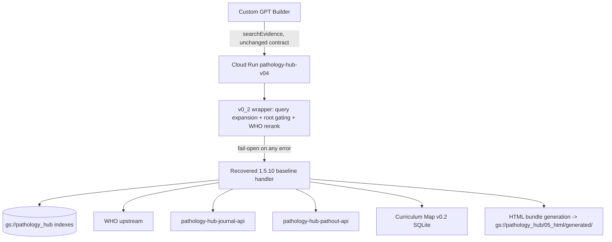

# Handoff — Pathology Hub Evidence Search Reliability v0_2 Production Release

**Date:** 2026-07-05 / 2026-07-06
**Workstream:** Backend API / Evidence RAG (production release)
**Status:** **COMPLETE AND LIVE IN PRODUCTION** as of 2026-07-06

---

## Purpose

Recover the authoritative live production backend source for `pathology-hub-v04`,
integrate Evidence Search Reliability v0_2 (query expansion, root gating, WHO rerank)
truly server-side behind feature flags, validate on staging with a live full-corpus
benchmark, and — upon explicit human approval — deploy to production with a gradual,
monitored traffic rollout and a ready rollback plan.

---

## Inputs assumed

| Input | Source |
|---|---|
| GCP project | `pathology-annotation-project` |
| Buckets | `gs://pathology_hub` (primary), `gs://pathology-hub-0` (legacy) |
| Production service | `pathology-hub-v04` (`https://pathology-hub-v04-vorn5q2kga-uc.a.run.app`) |
| Action | `searchEvidence` / `POST /evidence/search` (the only one, unchanged) |
| Auth | Header `X-API-Key` (Secret Manager: `pathology-hub-api-key`) |
| v0_1 live benchmark baseline | 979/1008 (97.1%), `06_audits/evidence_retrieval/benchmark_v0_1/` |
| v0_2 module (local, pre-existing) | `backend/evidence_search_reliability_v0_2/` |
| Prior-session planning docs | `HANDOFF_PRODUCTION_READINESS_20260705.md` and `docs/PRODUCTION_READINESS_MASTER_PLAN_20260705.md` |

---

## Outputs produced (this release, chronological)

### Phase 0 — Safety snapshot
- `docs/CURSOR_TRUE_WSL_PREFLIGHT_20260705.md`
- `docs/PRODUCTION_RELEASE_SAFETY_RULES_20260705.md`
- `docs/MAX_MODE_PRODUCTION_EXECUTION_LOG_20260705.md` (full phase-by-phase command log)
- `audits/prod_snapshot_pre_v0_2_20260705/` (service export, revisions, traffic, redacted env names, live health, 5/5 smoke tests)

### Phase 1 — Backend source recovery
- `docs/LIVE_BACKEND_RECOVERY_RESULTS_20260705.md` — **genuinely recovered**, not reconstructed (exact Cloud Build source tarball match to the live image digest)
- `docs/LIVE_RUNTIME_AND_CLOUDRUN_MAP_20260705.md`
- `docs/LIVE_VERSION_VERIFICATION_20260705.md` — confirmed live version `1.5.10-html-bundle`
- `recovered_source_inventory_20260705.txt`
- `recovered_backend/v04_10_live_source/` (the recovered source tree)

### Phase 2 — Canonical recovered backend
- `backend/pathology_hub_v04_live_recovered/` (the deployable tree — **this is what is now live in production**)
- `docs/LIVE_BACKEND_VS_LOCAL_1_5_7_RECONCILIATION_REPORT.md`
- `docs/WHY_STALE_1_5_7_MUST_NOT_BE_PATCHED_DIRECTLY.md`

### Phase 3 — v0_2 server-side integration
- `docs/V0_2_SERVER_SIDE_INTEGRATION_DESIGN_20260705.md`
- `docs/V0_2_SERVER_SIDE_INTEGRATION_DIFF_SUMMARY_20260705.md`

### Phase 4 — Miss diagnostics and rule tuning
- `docs/V0_2_29_MISS_DIAGNOSTIC_RESULTS_20260705.md`
- `docs/V0_2_1_RULE_CHANGELOG_20260705.md`
- `backend/query_expansion_rules_v0_2_1.json` (the rules deployed to production)
- `benchmark_v0_2/miss_diagnostics_20260705.jsonl`, `benchmark_v0_2/replay_miss_diagnostics.py`

### Phase 5 — Local tests
- `docs/V0_2_LOCAL_TEST_RESULTS_20260705.md` — 50/50 passing (27 pre-existing + 23 new)
- `tests/test_backend_live_recovered_health.py`, `tests/test_backend_live_recovered_search_contract.py`, `tests/test_v0_2_server_side_flags.py`, `tests/test_v0_2_fallback_behavior.py`, `tests/test_html_bundle_preservation.py`, `tests/test_figure_url_preservation.py`, `tests/test_source_status_contract.py`
- `audits/local_test_results_20260705/pytest_output.txt`

### Phase 6 — Staging deploy
- `docs/STAGING_DEPLOY_LOG_V0_2_20260705.md`
- `docs/STAGING_HEALTH_AND_SMOKE_RESULTS_20260705.md`
- `docs/STAGING_HEALTH_DEBUG_V0_2_20260705.md` / `docs/STAGING_REDEPLOY_FIX_LOG_V0_2_20260705.md` (health-responsiveness incident, root-caused and fixed in 1 cycle)
- `audits/staging_smoke_20260705/`, `audits/staging_health_debug_20260705/`

### Phase 7 — Staging benchmark
- `docs/V0_2_STAGING_BENCHMARK_RESULTS_20260705.md` — **996/1008 (98.81%), 12 misses**
- `docs/V0_2_REMAINING_MISS_REGISTER_20260705.md`
- `docs/V0_2_GO_NO_GO_DECISION_20260705.md` — **GO**, all 7 gates met
- `docs/PRODUCTION_ROLLBACK_PLAN_V0_2_20260705.md`, `docs/PROPOSED_PRODUCTION_DEPLOY_PLAN_V0_2_20260705.md`
- `benchmark_v0_2/staging_run_cycle_1.json`, `benchmark_v0_2/staging_run_cycle_1/`

### Phase 8/9 — Production deploy and rollout (explicitly human-approved)
- `docs/PRODUCTION_PREFLIGHT_REVERIFICATION_20260706.md`
- `docs/PRODUCTION_DEPLOY_LOG_V0_2_20260705.md`
- `docs/PRODUCTION_TRAFFIC_SHIFT_LOG_V0_2_20260705.md`
- `docs/PRODUCTION_POST_DEPLOY_HEALTHCHECK_V0_2_20260705.md`
- `audits/prod_preflight_20260706/`, `audits/prod_deploy_20260706/`, `audits/prod_traffic_shift_20260706/`

### Phase 9 (frontend) — GPT Builder package (docs only, GPT Builder not touched)
- `docs/OPENAPI_V0_2_ACTION_SCHEMA_DELTA_20260705.md` — no schema change needed
- `docs/GPT_BUILDER_V0_2_INSTRUCTIONS_DELTA_20260705.md`
- `docs/GPT_BUILDER_V0_2_FRONTEND_TEST_SCRIPT_20260705.md`

### Phase 10 — This release package
- This file, `MANIFEST_V0_2_PRODUCTION_RELEASE_20260705.csv`, `SHA256SUMS_V0_2_PRODUCTION_RELEASE_20260705.txt`, `pathology_hub_v0_2_production_release_20260705.zip`

---

## Schemas used

| Schema | Purpose |
|---|---|
| `pathology_hub_health.v1.5.10` | `/health` response |
| `evidence_search_response.v1.5.9` / `v1.5.10` | `/evidence/search` response (unchanged externally; v0_2 fields are additive under `additionalProperties: true`) |
| `evidence_query_expansion_rules.v0_2_1` | `backend/query_expansion_rules_v0_2_1.json` |
| `evidence_retrieval_benchmark_staging_v0_2.v1` | `benchmark_v0_2/staging_run_cycle_1.json` |
| `production_deploy_v0_2.v1` | Phase 8/9 upload audit |
| `pathology_hub_env_var_names_redacted.v1` | Redacted env var name snapshots |

---

## GCS paths touched (all additive, zero deletions/overwrites)

```
gs://pathology_hub/06_audits/backend_api/prod_snapshot_pre_v0_2_20260705/
gs://pathology_hub/06_audits/backend_api/v0_2_staging_20260705/
gs://pathology_hub/06_audits/backend_api/v0_2_staging_debug_20260705/
gs://pathology_hub/06_audits/backend_api/v0_2_production_20260705/
gs://pathology_hub/06_audits/evidence_retrieval/v0_2_staging_20260705/
gs://pathology_hub/06_audits/evidence_retrieval/v0_2_staging_debug_20260705/
gs://pathology_hub/06_audits/evidence_retrieval/v0_2_production_20260705/
gs://pathology_hub/05_html/generated/searchEvidence_html/v1_5_10/  (incidental, expected HTML bundle test outputs)
```

---

## API endpoints

### Provided (live, unchanged)

| Method | Path | operationId |
|---|---|---|
| GET | `/health` | — (infra only, not a GPT Action) |
| POST | `/evidence/search` | `searchEvidence` |

**One Action only, before and after this release.**

---

## Staging URL

`https://pathology-hub-v04-v0-2-staging-vorn5q2kga-uc.a.run.app` (revision
`pathology-hub-v04-v0-2-staging-00004-hvf`, v0_2 enabled, `min-instances=1`)

## Production URL / final revision

`https://pathology-hub-v04-vorn5q2kga-uc.a.run.app` — **100% traffic on revision
`pathology-hub-v04-00028-guf`** (`version: 1.5.10-html-bundle-v0.2-prod`), as of the
end of this session.

---

## Integration points



| Integration | Status |
|---|---|
| GPT -> production API | Live, unchanged contract |
| v0_2 -> search handler | **Now server-side integrated in production** (was: client-side simulation only) |
| Curriculum tag index -> API | Live (unchanged, inherited from the recovered 1.5.9 block) |
| HTML bundle generation | Live (unchanged, inherited from the recovered 1.5.10 block) |

---

## Tests / audits

| Audit / test | Result | Location |
|---|---|---|
| v0_2 unit tests (pre-existing) | 27/27 PASS | `tests/test_evidence_*_v0_2.py` |
| New local tests (this release) | 23/23 PASS | `tests/test_backend_live_recovered_*.py`, `tests/test_v0_2_*.py`, `tests/test_html_bundle_preservation.py`, `tests/test_figure_url_preservation.py`, `tests/test_source_status_contract.py` |
| Staging smoke | 10/10 PASS | `docs/STAGING_HEALTH_AND_SMOKE_RESULTS_20260705.md` |
| **Staging live benchmark (1008 rows)** | **996/1008 (98.81%), 12 misses** | `docs/V0_2_STAGING_BENCHMARK_RESULTS_20260705.md` |
| Production candidate smoke (0% traffic) | 10/10 PASS | `docs/PRODUCTION_DEPLOY_LOG_V0_2_20260705.md` |
| Production rollout health/smoke (10%/50%/100%) | All PASS, 0 rollback | `docs/PRODUCTION_TRAFFIC_SHIFT_LOG_V0_2_20260705.md` |
| Production final post-deploy check | 10/10 PASS | `docs/PRODUCTION_POST_DEPLOY_HEALTHCHECK_V0_2_20260705.md` |

---

## Benchmark result summary

| Metric | v0_1 baseline | v0_2 staging (this release) |
|---|---|---|
| Hits | 979/1008 | **996/1008** |
| Misses | 29 | **12** |
| Hit rate | 97.1% | **98.81%** |
| Regressions | — | **0** |

## Miss analysis — 12 remaining, all documented

| Entity | Rows | Disposition |
|---|---|---|
| BREAST_002 (NOS) | 2 | **Attempted fix (WHO title-boost alias), unsuccessful. Accepted as known limitation by repo owner. Tracked as v0_3 follow-up: investigate query-expansion-mode change vs. retrieval-pool size.** |
| GU_003 (CIS) | 2 | Accepted risk — deliberately left gated (3-root ambiguity: GU/GYN/Skin) |
| GU_005 (Nephrogenic adenoma) | 2 | **General WHO ranking limitation, not attempted this release. Accepted as known limitation by repo owner. Tracked as v0_3 follow-up: title-boost weighting for full-title matches vs. token-overlap matches.** |
| SKIN_001 (Bullous pemphigoid) | 6 | True corpus gap — not a WHO Classification of Tumours entity; no fix applicable |

Full detail: `docs/V0_2_REMAINING_MISS_REGISTER_20260705.md`.

---

## Known limitations (honest, complete list)

1. BREAST_002/NOS and GU_005 misses remain (4 rows total) — explicitly accepted by
   the repo owner as known limitations for this release, tracked as v0_3 tickets.
2. Bullous pemphigoid (6 rows) is a true, permanent corpus gap given the WHO
   Classification of Tumours scope — not fixable within this workstream.
3. `CIS` standalone abbreviation remains intentionally un-expanded (2 rows) due to
   genuine 3-root ambiguity — a deliberate safety choice, not a defect.
4. Production `min-instances` remains 0/unset (unchanged from before this release) —
   a future idle period will incur the same ~90-110s cold start observed throughout
   this session on both staging (before its fix) and production. This was
   **explicitly out of the approved Phase 8/9 scope** (only staging's min-instances
   was changed in this release) and is called out here for future consideration.
5. GPT Builder itself was never opened or modified — the 3 frontend docs in this
   release are proposals for human review only.

---

## Rollback plan

See `docs/PRODUCTION_ROLLBACK_PLAN_V0_2_20260705.md` (finalized with actual revision
IDs). Current exact command:

```bash
gcloud run services update-traffic pathology-hub-v04 \
  --to-revisions=pathology-hub-v04-00027-tjm=100 \
  --project=pathology-annotation-project --region=us-central1
```

`pathology-hub-v04-00027-tjm` (the pre-v0_2 stable revision) still exists, undeleted,
at 0% traffic, immediately available.

---

## Final production state (as of end of session, 2026-07-06)

- Service: `pathology-hub-v04`
- Revision: `pathology-hub-v04-00028-guf`
- Traffic: 100%
- Version: `1.5.10-html-bundle-v0.2-prod`
- v0_2 flags: `EVIDENCE_V0_2_ENABLED=true`, `EVIDENCE_QUERY_EXPANSION_ENABLED=true`,
  `EVIDENCE_ROOT_GATING_ENABLED=true`, `EVIDENCE_WHO_RERANK_ENABLED=true`,
  `EVIDENCE_V0_2_DEBUG=false`
- No rollback occurred during rollout.
- GPT Builder: unchanged.

---

## Exact next steps

1. Monitor production for the standard 24h post-deploy window (per the master plan's
   order of operations) — watch for any `v0_2_*_failed` warning strings appearing in
   logs at a higher-than-zero rate, and watch general error/latency dashboards.
2. Decide whether to set `min-instances >= 1` on production (currently 0) to eliminate
   the cold-start characteristic entirely — a pure infra change, no code risk, same fix
   already applied to staging.
3. File the two v0_3 follow-up tickets (BREAST_002/NOS query-pool investigation;
   GU_005 general WHO ranking-weight tuning) referencing
   `docs/V0_2_REMAINING_MISS_REGISTER_20260705.md`.
4. If desired, apply the optional GPT instruction refinement in
   `docs/GPT_BUILDER_V0_2_INSTRUCTIONS_DELTA_20260705.md` (human action in GPT Builder,
   out of this session's scope).
5. Run the manual GPT Preview test script
   (`docs/GPT_BUILDER_V0_2_FRONTEND_TEST_SCRIPT_20260705.md`) for end-to-end frontend
   confirmation.
